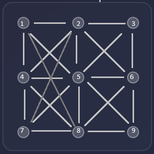

# Patrones de Cuadrícula 3x3

Este script encuentra todos los patrones (ciclos cerrados) en una cuadrícula de 3x3 puntos (numerados del 1 al 9) *(observar la imagen de referencia)* que cumplen las siguientes condiciones:



## Reglas

1. **Aristas permitidas**: Solo se pueden usar las siguientes conexiones:
   - Horizontales: 1-2, 2-3, 4-5, 5-6, 7-8, 8-9
   - Verticales: 1-4, 2-5, 3-6, 4-7, 5-8, 6-9
   - Diagonales cortas: 1-5, 2-4, 2-6, 3-5, 4-8, 5-7, 5-9, 6-8
   - Diagonales largas: 1-8, 2-7

2. **Ciclo cerrado**: El patrón debe comenzar y terminar en el mismo punto, sin pasar dos veces por el mismo punto (ciclo simple).

3. **Condición de arista inferior**: Al menos una de las aristas (7-8) u (8-9) debe estar presente (base del cuerpo).

4. **Restricciones de cruce** (aristas que no pueden coexistir):
   - Las diagonales cortas dentro del mismo "cuadrante":
      * 1-5 y 2-4
      * 2-6 y 3-5
      * 4-8 y 5-7
      * 5-9 y 6-8
   - Las diagonales largas no pueden cruzarse entre ellas ni con la horizontal 4-5, tampoco:
      * la diagonal 1-8 con 2-4 ni 5-7
      * la diagonal 2-7 con 1-5 ni 4-8

5. **Pares prohibidos adicionales (dividen el volumen del cuerpo)**:
   - 1-2 y 2-3 no pueden estar ambas
   - 3-6 y 6-9 no pueden estar ambas
   - 2-5 y 5-8 no pueden estar ambas
   - 4-5 y 5-6 no pueden estar ambas
   - 1-5 y 5-9 no pueden estar ambas
   - 3-5 y 5-7 no pueden estar ambas

## Uso

### Requisitos
- Node.js (versión 12 o superior)

### Ejecución
```bash
node gridPatterns.js
```

### Resultados
El script generará:
1. Lista de patrones encontrados en la consola
2. Archivo `js/patrones.json` con todos los patrones en formato JSON
3. Visualización ASCII de los primeros 3 patrones

### Archivos
- `gridPatterns.js`: Script principal
- `js/patrones.json`: Resultados generados (se crea al ejecutar)

## Ejemplo de salida
```
Buscando patrones...
Aristas posibles: 22
Combinaciones totales: 4194304
Patrones encontrados: 12

Lista de patrones (aristas):
1: 1-2, 2-5, 5-4, 4-1
2: ...
```

## Notas
- El algoritmo prueba todas las combinaciones posibles de aristas (4.2 millones) y filtra según las reglas.
- Cada patrón es un ciclo simple: todos los vértices usados tienen exactamente dos aristas, y el grafo es conexo.
- La visualización ASCII es básica y puede superponer caracteres en casos complejos.

## Personalización
Puede modificar las reglas editando las funciones `violatesCrossing` y `isSimpleCycle` en `gridPatterns.js`.